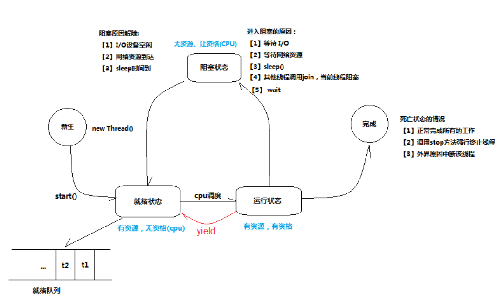

# 课节02 线程的生命周期

## 5个状态：
+ 新建状态:
使用 `new` 关键字和 `Thread` 类或其子类建立一个线程对象后，该线程对象就处于新建状态。它保持这个状态直到程序 `start()` 这个线程。

+ 就绪状态:
当线程对象调用了`start()`方法之后，该线程就进入就绪状态。就绪状态的线程处于就绪队列中，要等待JVM里线程调度器的调度。

+ 运行状态:
如果就绪状态的线程获取 CPU 资源，就可以执行 `run()`，此时线程便处于运行状态。处于运行状态的线程最为复杂，它可以变为阻塞状态、就绪状态和死亡状态。

+ 阻塞状态:
如果一个线程执行了`sleep`（睡眠）、`suspend`（挂起）等方法，失去所占用资源之后，该线程就从运行状态进入阻塞状态。在睡眠时间已到或获得设备资源后可以重新进入就绪状态。可以分为三种：

    + 等待阻塞：运行状态中的线程执行 `wait()` 方法，使线程进入到等待阻塞状态。

    + 同步阻塞：线程在获取 `synchronized` 同步锁失败(因为同步锁被其他线程占用)。

    + 其他阻塞：通过调用线程的 `sleep()` 或 `join()` 发出了 I/O 请求时，线程就会进入到阻塞状态。当`sleep()` 状态超时，`join()` 等待线程终止或超时，或者 I/O 处理完毕，线程重新转入就绪状态。

+ 死亡状态:
一个运行状态的线程完成任务或者其他终止条件发生时，该线程就切换到终止状态。

## 图例：

### 生命周期


### 原因分析


## 代码示例：
```java
public class ThreadLifeTest extends Thread {

    public ThreadLifeTest(String name){
        super(name);
    }


    public void run(){
        // 运行状态
        System.out.println("----- [ " + super.getName() +" ] ----- 运行状态 ----");

        try {
            long interval = 10 * 1000;
            // 阻塞状态
            Thread.sleep(interval);
            System.out.println("----- [ " + super.getName() +" ] ----- 阻塞状态 ---- 阻塞时长：" + interval + "ms");
        } catch (InterruptedException e) {
            e.printStackTrace();
        }
    }

    public static void main(String[] args) throws InterruptedException {
        // 新建状态 | 初始化
        ThreadLifeTest nice = new ThreadLifeTest("Nice");
        System.out.println("----- [ " + nice.getName() + " ] ---- 初始化完成 ----");
        // 就绪状态
        System.out.println("----- [ " + nice.getName() + " ] ---- 就绪状态 ----");
        nice.start();

        nice.join();

        // 死亡状态
        System.out.println("----- [ " + nice.getName() + " ] ---- 死亡状态 ----");
    }
}
```