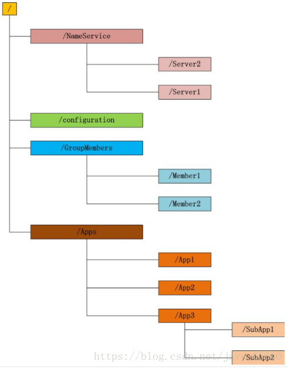

# uzy-practice-distributed

## 简介
[@ZooKeeper百科](https://baike.baidu.com/item/zookeeper)

ZooKeeper是一个分布式的，开放源码的分布式应用程序协调服务，是Google的Chubby一个开源的实现，是Hadoop和Hbase的重要组件。它是一个为分布式应用提供一致性服务的软件，提供的功能包括：配置维护、域名服务、分布式同步、组服务等。

如下图所示：

每个子目录项如 NameService 都被称作为 znode(目录节点)，和文件系统一样，我们能够自由的增加、删除znode，在一个znode下增加、删除子znode，唯一的不同在于znode是可以存储数据的。

有四种类型的znode：

+ `PERSISTENT`-持久化目录节点

  客户端与zookeeper断开连接后，该节点依旧存在

+ `PERSISTENT_SEQUENTIAL`-持久化顺序编号目录节点

  客户端与zookeeper断开连接后，该节点依旧存在，只是Zookeeper给该节点名称进行顺序编号

+ `EPHEMERAL`-临时目录节点

  客户端与zookeeper断开连接后，该节点被删除

+ `EPHEMERAL_SEQUENTIAL`-临时顺序编号目录节点

  客户端与zookeeper断开连接后，该节点被删除，只是Zookeeper给该节点名称进行顺序编号